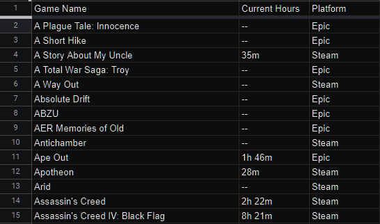

# HLTB (How Long To Beat)
Grab the hours required to beat a list of games. Data for completion times is sourced from 
[howlongtobeat.com](https://howlongtobeat.com)

## Node Script
This script uses the [HLTB wrapper from ckatzorke](https://github.com/ckatzorke/howlongtobeat).

### Instructions for use
Setup a google sheet with 3 columns: Game Name, Current Hours, & Platform, and populate each row with the games you 
want to process.

Now `ctrl + shift` from the very top-left cell to the bottom-right cell,
and `ctrl + v` that data into a file at the same level as the `loadGames.js` script called `games.csv`. 
This is the file that will be loaded into the node script. Double-check that each row item is separated by tabs.

Run `npm i` to install the dependencies. Then, you can run `node loadGames.js`

## Python HTML parser

Initially I wanted to scrape HLTB to retrieve the data from there directly for my list of games.
My language of choice for this was Python, for the useful `request_html` session (for delayed renders) and
for the powerful beautiful soup library for HTML parsing. Alas, I was defeated by HLTB's weird routing and 
non-deterministic links.

To use the parser, you need to search your Steam username in the HLTB website. This will 
return a page with a list of your Steam games, current playtime, and time to beat. Right click to save this HTML page.
Save this page as `collectionSearch.html` in a folder called `html` adjacent to the `hltb-scrape.py` script.

This script should then be runnable. It will produce an output CSV file that you can import into Google Sheets or Excel
where you can perform operations on it. This CSV file was then pumped into a google sheet [(see this markdown file for 
my early sheets setup).](googleSheets.md)

Limitations: this doesn't include the normal HLTB metrics of Main, Main + Extra, Completionist. This also doesn't grab 
non-Steam games. It also won't work if you don't have your Steam profile set to public.
