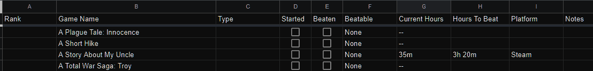

# Google Sheets setup

## Initial Structure
I started with some basic table headings and needed to populate the rows with data.


The original sheet structure pulled in data from sub-sheets with complicated VLOOKUP formulae. 
This was done as I could only retrieve HLTB data from saving the lookup of my steam username,
and then parsing that with python to grab all my steam games. 


My next logical step (at the time)
appeared to be to then add a number of other sub-sheets (eg. for epic games) and manually populate 
the values. This would have caused deep nested if statements to progressively check the next game 
store's games to populate the main sheet. This is where I stopped, and decided to try something else; 
starting from the list of games first, and then pulling the HLTB data with an existing scraper wrapper.

### Original formulae based on the python html parsing method:

Un-minified query to grab completion hours from the raw steam data sheet, 
and if that data doesn't exist, to grab it from the epic raw data sheet.
```swift
=IF(
    ISNA(
        VLOOKUP(
            "*" & B2 & "*",
            'steam raw data'!$A$2:$D$371,
            2, 
            FALSE
        )
    ),
    VLOOKUP(
        "*" & B2 & "*",
        'epic raw data'!$A$2:$D$371,
        2, 
        FALSE
    ),
    VLOOKUP(
        "*" & B2 & "*",
        'steam raw data'!$A$2:$D$371,
        2, 
        FALSE
    )
)
```

Similar query to grab the hours to beat data from the raw sheets
```swift
=IF(
    ISNA(
        VLOOKUP(
            "*" & B2 & "*",
            'steam raw data'!$A$2:$D$371,
            3, 
            FALSE
        )
    ),
    VLOOKUP(
        "*" & B2 & "*",
        'epic raw data'!$A$2:$D$371,
        3, 
        FALSE
    ),
    VLOOKUP(
        "*" & B2 & "*",
        'steam raw data'!$A$2:$D$371,
        3, 
        FALSE
    )
)
```

Simpler query that will mark the cell as steam if the how long to beat value isn't NA
```swift
=IF(
    ISNA(
        VLOOKUP(
            "*" & B2 & "*",
            'steam raw data'!$A$2:$D$371,
            3, 
            FALSE
        )
    ),
    "",
    "Steam"
)
```